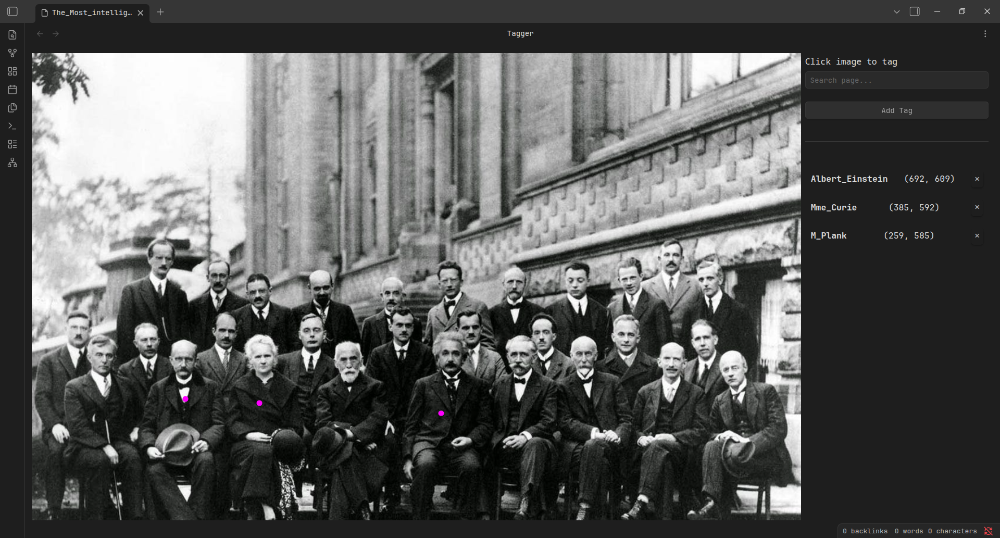
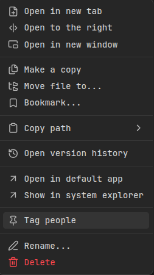

# Photo tagging

Obsidian plugin for tagging people on photos.

- [Motivation](#motivation)
- [Installation](#installation)
- [Manual](#manual)
- [BDFL](#bdfl)

## Motivation

I have a lot of genealogy data regarding my family and its history. I use Obsidian to work with this data.
At some point, I needed a simple software to tag people on photos and then show a person's photos on their page.
I did not find the existing plugin, so I decided to write my own.

## Installation

> [!NOTE]
> The plugin has not been submitted to the [official list of plugins](https://github.com/obsidianmd/obsidian-releases/blob/master/community-plugins.json) because it is used only by me, and I wrote it especially for my own needs.
> If you find this plugin useful and want it to be in the official plugins list, please create an issue, and I will do it.

You can try this plugin by cloning the repo and enabling it in the Obsidian vault settings.

1. Clone the repo into the `plugins/` directory:
   ```bash
   mkdir -p {vault}/.obsidian/plugins/
   cd {vault}/.obsidian/plugins/
   git clone https://github.com/TheBestTvarynka/photo-tagging.git
   ```
2. Enable the Photo-tagging plugin in Obsidian settings (`Community Plugins` section).

## Manual

1. You manually add tags to photos using the built-in tagger:
   
   
   You can open tagger from the file context menu (`Tag people` option):
   
   
2. Every tag is linked to some note. In my case, every note represents a person.
3. Add the following code block to see the person's photos inside the note:
   ```md
       ```tagged-photos
       ```
   ```
   The plugin automatically resolves photos assigned to the current person:

   

All tags are saved inside JSON file. By default, the JSON file is located in the `photo-tags.json` at the root of the vault.
You can change it in the plugin settings.

## BDFL

Did you hear about [BDFL](https://en.m.wikipedia.org/wiki/Benevolent_dictator_for_life)?

TL;DR:

> **Benevolent dictator for life (BDFL)** is a title given to a small number of open-source software development leaders, typically project founders who retain the final say in disputes or arguments within the community.

For the Photo-tagging project, the BDFL is [@TheBestTvarynka (Pavlo Myroniuk)](https://github.com/TheBestTvarynka), original creator of Photo-tagging.
