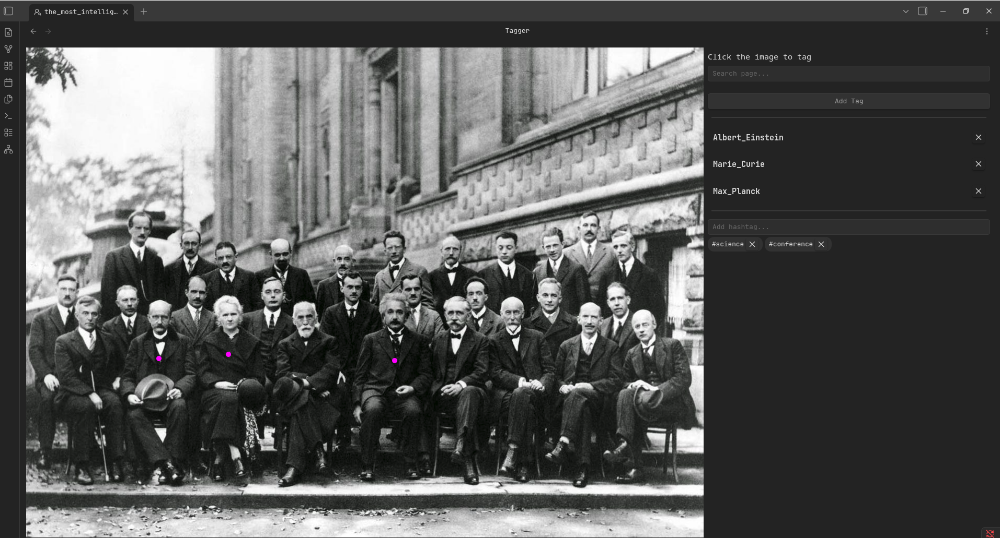
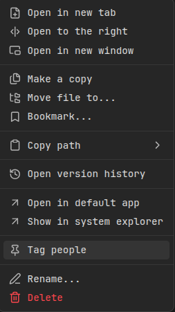
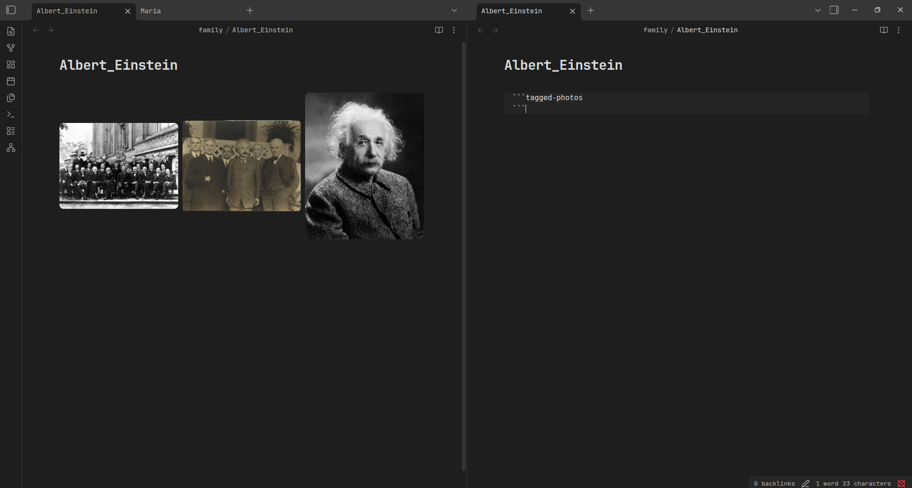

# Photo tagging

Obsidian plugin for tagging people on photos

  - [Motivation](#motivation)
  - [Installation](#installation)
    - [Obsidian Community Plugins](#obsidian-community-plugins)
    - [Manual installation](#manual-installation)
  - [Manual](#manual)
  - [BDFL](#bdfl)

## Motivation

I have a lot of genealogy data regarding my family and its history. I use Obsidian to work with this data.
At some point, I needed a simple software to tag people on photos and then show a person's photos on their page.
I did not find the existing plugin, so I decided to write my own.

## Installation

### Obsidian Community Plugins

The photo-tagging plugin is available in the [Obsidian Community Plugins](https://obsidian.md/help/community-plugins) list. So, you can install it right from the Obsidian app. Here is a direct link to the plugin page: https://community.obsidian.md/plugins/photo-tagging.

### Manual installation

You can install the plugin by downloading the release assets, placing them inside your Obsidian vault, and enabling it in the settings:

1. Go to the [TheBestTvarynka/photo-tagging/releases](https://github.com/TheBestTvarynka/photo-tagging/releases) page and download release assets: `main.js`, `manifest.json`, and `styles.css`.
2. Place these files in the vault plugin directory:

```bash
VAULT_DIR=/path/to/vault
PHOTO_TAGGING_DIR=${VAULT_DIR}/.obsidian/plugins/photo-tagging
mkdir -p ${PHOTO_TAGGING_DIR}
cp main.js ${PHOTO_TAGGING_DIR}
cp styles.css ${PHOTO_TAGGING_DIR}
cp manifest.json ${PHOTO_TAGGING_DIR}
```

3. Enable the Grafily plugin in the Obsidian settings (`Community Plugins` section).

## Manual

1. You manually add tags to photos using the built-in tagger:
   
   
   You can open tagger from the file context menu (`Tag people` option):
   
   
2. Every tag is linked to some note. In my case, every note represents a person.
3. Add the following code block to see the person's photos inside the note:
   ```md
       ```tagged-photos
       ```
   ```
   The plugin automatically resolves photos assigned to the current person:

   

All tags are saved inside JSON file. By default, the JSON file is located in the `photo-tags.json` at the root of the vault.
You can change it in the plugin settings.

## BDFL

Did you hear about [BDFL](https://en.m.wikipedia.org/wiki/Benevolent_dictator_for_life)?

TL;DR:

> **Benevolent dictator for life (BDFL)** is a title given to a small number of open-source software development leaders, typically project founders who retain the final say in disputes or arguments within the community.

For the Photo-tagging project, the BDFL is [@TheBestTvarynka (Pavlo Myroniuk)](https://github.com/TheBestTvarynka), original creator of Photo-tagging.
